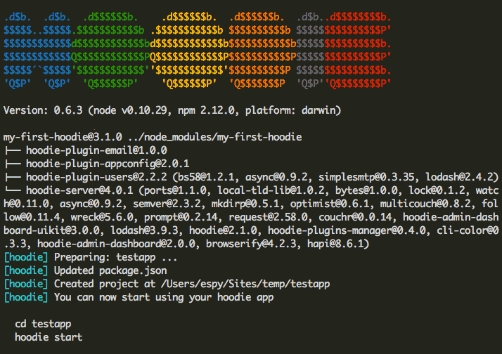
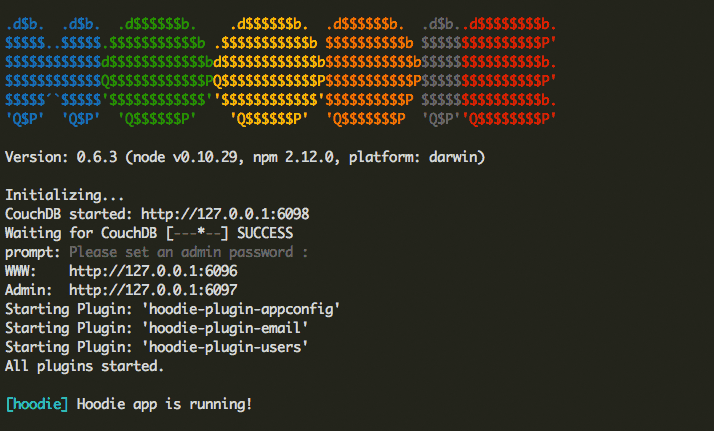

# Démarrer avec Hoodie - Partie 1

Ceci est la première partie de Démarrer avec Hoodie, qui décrit les premières étapes après que vous ayez [installé Hoodie et ses prérequis](/fr/start) avec succès. Dans ce guide vous allez créer une application Hoodie de démo en apprenant la structure d'un projet Hoodie et ses différents répertoires, les URL de connection et de l'application et comment inclure et utiliser la bibliothèque Hoodie dans votre projet.

### Sujets couverts par ce guide

1. Créer une nouvelle application
2. Les URL de l'application, de l'administration et de Futon
3. La structure d'un projet Hoodie
4. Inclure le script
5. L'objet global window.hoodie

Si vous rencontrez des problèmes à quelque étape que ce soit dans cette doc, allez voir notre <a href="http://faq.hood.ie" target="_blank">FAQ</a> ou <a href="http://hood.ie/chat" target="_blank">rejoignez-nous sur IRC ou Slack</a>.

### 1. Créer une nouvelle application

Hoodie fournit un outil en ligne de commande appelé Hoodie-CLI qui vous aide pour un grand nombre de tâches liées à Hoodie, comme configurer et lancer une application. Si vous avez le moindre doute concernant CLI, vous pouvez lui demander de l'aide&#x202F;:

```bash
$ hoodie -h
```

Si vous n'avez jamais travaillé avec le terminal avant, parcourez rapidement <a href="http://blog.teamtreehouse.com/introduction-to-the-mac-os-x-command-line" target="_blank">ces astuces</a>&#x202F;! **Astuce 1**&#x202F;: ne tapez pas le signe dollar, c'est juste une convention qui signifie que la ligne de code devrait être lancée dans un terminal.

La toute première étape est **d'utiliser Hoodie-CLI pour créer une nouvelle application**. Dans votre terminal, placez vous dans le répertoire où vous voulez que votre application se retrouve et entrez&#x202F;: 

```bash
$ hoodie new testapp
```

Voilà ce qui en résultera&#x202F;:


Hoodie a téléchargé toutes les bibliothèques dont il a besoin pour faire le scaffolding (NdT&#x202F;: littéralement "échafaudage", un mécanisme qui va créer les répertoires et fichiers minimums pour le projet à votre place) de votre application, configurer le code serveur et installer les plugins par défaut. Vous trouverez désormais un répertoire **testapp**, dans lequel vous trouverez une simple application de démo. Ouvrez le répertoire et démarrer le serveur Hoodie&#x202F;:

```bash
$ cd testapp
$ hoodie start
```

Au premier lancement, il vous sera demandé d'entrer un mot de passe pour la tableau de bord d'administration; choisissez quelque-chose de simple pour le moment, comme **"Abitbol"**. Parce que George Abitbol est l'homme le plus classe du monde. Ensuite, un paquet d'URLs et autres informations additionnelles apparaîtront.

### 2. Les URL de l'application, de l'administration et de Futon

Parfait, votre application a démarré et vous a dit un certain nombre de choses sur elle-même, par exemple à quelle URL vous pouvez accéder à l'application ou quels plugins sont actifs. La première chose que vous noterez cependant est que Hoodie ouvre un navigateur avec l'application démo déjà ouverte.

**Note**&#x202F;: si vous ne voulez pas que Hoodie ouvre un nouvel onglet dans votre navigateur, démarrez le serveur Hoodie avec

```bash
$ hoodie start -n
```

Le **-n** veut dire "pas de nouvel onglet dans le navigateur s'il te plait, j'en ai déjà un."

Quoiqu'il en soit, vous verrez trois URLs dans l'affichage de la CLI. Nous allons passer en revue les trois.



**Note&#x202F;:** Les ports peuvent varier, du fait de la méthode que Hoodie utilise pour choisir les nouveaux ports disponibles pour de multiples applications. S'il s'agit de votre première application, les ports devraient démarrer à partir de 6001.

##### L'URL CouchDB&#x202F;:

```bash
CouchDB started: http://127.0.0.1:6098
```

C'est ce qu'utilise la bibliothèque Hoodie pour récupérer et stocker les données. Vous pouvez y ajouter **/_utils** pour atteindre l'outil d'administration de CouchDB (similaire à phpMyAdmin pour MySQL), qui s'appelle Futon (et sera bientôt renommé Fauxton). Vous vous connectez à Futon (ou Fauxton) avec le mot de passe d'administration que vous avez entré précédemment. Pour le moment, vous n'avez pas réellement à vous en soucier, mais plus tard ce sera utile pour inspecter la base de données.

##### L'URL de l'application

```bash
WWW:    http://127.0.0.1:6096
```

C'est l'URL que Hoodie a ouvert dans le navigateur pour vous, c'est là que l'application est lancée.


##### L'URL du tableau de bord d'administration

```bash
Admin:  http://127.0.0.1:6097
```

Nous traiterons le tableau de bord dans un guide ultérieur, mais c'est là que vous pouvez voir combien d'utilisateurs vous avez, réinitialiser les mots de passe, visualiser les panneaux d'administration des plugins, etc. Encore une fois, le mot de passe d'administration est celui que vous avez choisi précédemment.

Maintenant, avant de jeter un coup d'oeil à l'application de démo, arrêtons le serveur avec **ctrl+c** (sous MacOS X/Linux) ou **alt+c** (sous Windows) et jetons un rapide coup d'oeil au répertoire de l'application.

### 3.La structure d'un projet Hoodie

Listez les fichiers et dossiers de votre répertoire courant en tapant

```bash
$ ls
```
Et vous devriez voir quelque-chose comme ça&#x202F;:

```bash
README.md   data        node_modules    package.json    www
```

##### README.md (fichier)

Commençons par le plus facile&#x202F;: le fichier readme.
Comme son nom le suggère, vous devriez le lire, car il contient de nombreuses informations utiles. 

##### package.json (fichier)

Toutes les applications Hoodie sont des applications Node.js et toutes les applications Node.js nécessite un fichier **package.json**. Il défini le nom de l'application (**testapp** dans notre cas) et ses dépendances. Il est aussi utilisé pour installer et déclarer les versions utilisées de <a href="https://github.com/hoodiehq/hoodie-server" target="_blank">hoodie-server</a> et de tous les plugins coeurs.

##### node_modules (dossier)

C'est ici que npm, le système de gestion de paquets de Node, conserve tous ses fichiers. Hoodie l'utilise pour gérer ses plugins et dépendances, et vous pouvez l'utiliser pour gérer les modules frontend et backend de votre application. Le contenu de ce dossier est déterminé par le fichier **package.json** décrit ci-dessus. Pour en savoir plus sur npm, allez voir <a href="http://howtonode.org/introduction-to-npm" target="_blank">cette introduction</a>.

Le contenu de ce dossier est essentiel pour que l'application Hoodie fonctionne, aussi il y a deux choses à se rappeler&#x202F;:

1. Ne modifiez pas le contenu de ce dossier manuellement (seulement en utilisant npm).
2. N'ajoutez pas ce dossier à votre contrôle de source.

Toutes vos modifications aux fichiers de ce dossier seront écrasées à chaque fois que vous installerez ou mettrez à jour les dépendances et il n'y a pas d'intérêt à mettre ce dossier énorme dans le contrôle de source, puisque tout le monde peut le reconstituer avec la simple commande&#x202F;:

```bash
$ npm install
```

##### data (dossier)

Hé oui, c'est votre base de donnée. Elle n'est pas cachée dans **usr/local/** quelque-part, elle est directement dans le dossier de l'application. Cette configuration permet de déplacer facilement l'application et ses données sur un autre système sans trop d'efforts. De plus, si vous avez besoin de supprimer toutes vos données de test durant le développement, vous pouvez simplement supprimer ou renommer ce répertoire, Hoodie le recréera et vous pourrez partir d'une page blanche. En fait, ce dossier n'est pas généré par **hoodie new** mais en lançant l'application au moins une fois. **Vous devriez aussi laisser ce dossier en dehors du contrôle de source.**

##### www (dossier)

C'est ici que votre application réside. Il contient l'habituel fichier **index.html** et tous les fichiers accessoires de l'application. Si vous utilisez des constructeurs comme Grunt ou Gulp, c'est ici que vous devriez déposer votre code compiler (c'est pratiquement votre dossier **dist**). Hoodie ne s'occupe pas de ce que vous ajoutez au dossier de l'application, vous pouvez par conséquent y déposer votre dossier source, vos tests, de la documentation additionnelle, tout ce que vous voulez.

Bien entendu, vous ne voulez pas démarrer votre implémentation avec l'application démo Hoodie à chaque fois, aussi **hoodie new** supporte l'utilisation de templates. Ces templates prennent la forme de paquets npm

```bash
hoodie new appname -t npm package
```
ou de référentiels github

```bash
hoodie new appname -t githubusername/reponame
```

<a href="https://github.com/zoepage/hoodie-app-skeleton" target="_blank">Voici un template de base sur lequel vous pouvez démarrer votre prochaine application Hoodie.</a>

### 4. Inclure le script

L'application démo aura toujours cette ligne dans son **index.html**, mais à la base, tout ce dont vous avez besoin pour rendre votre application prête à utiliser Hoodie est d'inclure la seule bibliothèque **js**&#x202F;:

<pre><code class="language-markup">
&lt;script src="/_api/_files/hoodie.js"&gt;&lt;/script&gt;
</code></pre>

Vous noterez que ce fichier n'est pas dans **node_modules** ou un dossier **vendor** ou **lib**, il est *servi directement par le serveur Hoodie lui-même*. C'est cool parce qu'il contient aussi automatiquement tous les plugins installés pour le code du frontend. C'est toujours moins de tracas pour vous&#x202F;!

Et c'est à peu près tout&#x202F;! Vous êtes prêt à démarrer.

### 5. L'objet global window.hoodie

Hoodie est conçu pour construire des frontends comme vous aimez construire des frontends. Le seul moyen de parler à Hoodie depuis le frontend de votre application est l'API Hoodie, qui réside dans l'objet global window et qui, sans surprise, s'appelle **window.hoodie**, ou simplement **hoodie**.

Allez-y, ouvrez l'application dans votre navigateur, ouvrez la console dans les outils de développement de votre navigateur et tapez **hoodie.**. Ceci vous montrera toutes les méthodes accessibles globalement, comme **hoodie.account** ou **hoodie.store**, qui sont les plus importants. Nous en traiterons dans la prochaine partie de ce guide.

#### Bien joué&#x202F;!

Jusqu'ici, **félicitations&#x202F;!**, vous avez créé une application Hoodie de démo, vous avez appris la structure de base d'un projet Hoodie, vous connaissez toutes les connexions et URL de l'application et comment inclure la bibliothèque Hoodie dans votre projet. Vous êtes prêt pour la [deuxième partie](/fr/tutorials/)&#x202F;!

#### Des soucis&#x202F;?

Allez voir la <a href="http://faq.hood.ie" target="_blank">FAQ</a> ou <a href="http://hood.ie/chat" target="_blank">contactez-nous via IRC ou Slack</a>. Nous aimerions aussi avoir de vos nouvelles si tout s'est bien passé&#x202F;!

Si vous trouvez une erreur dans ce guide ou dépassé, vous pouvez aussi <a href="https://github.com/hoodiehq/documentation/issues" target="_blank">ouvrir un ticket</a> ou soumettre une pull request avec vos corrections sur <a href="https://github.com/hoodiehq/documentation/blob/gh-pages/fr/start/getting-started/getting-started-1.md" target="_blank">ce fichier</a>.

Merci de votre intérêt et de votre temps&#x202F;!